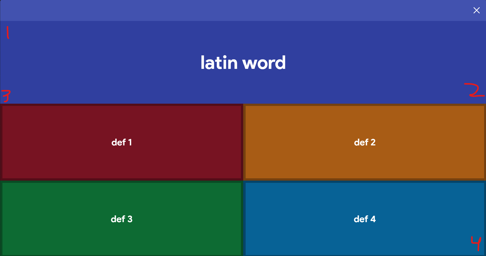

# How to Use

1. Install python version 3.14.x
2. Install tesseract (LINK)
3. Create a folder anywhere on your computer and put goykit.py into it
4. Open gimkit and go to the question screen
5. Open a terminal targeting said folder and run `python goykit.py`
6. Follow the instructions it gives you by pressing in the areas shown here 

### Installing tesseract

1. Go to [github](https://github.com/tesseract-ocr/tesseract)
2. Download the latest release and add it to environment variables
3. Download [lat.traineddata](https://github.com/tesseract-ocr/tessdata/blob/main/lat.traineddata) and add it to C:\Program Files\Tesseract-OCR\tessdata (unless download path was changed)
4. Open CMD and run tesseract --version to check

### First setup

When the file is first run it will need to calibrate positions for different screen sizes (can be rerun with `--reset`)
